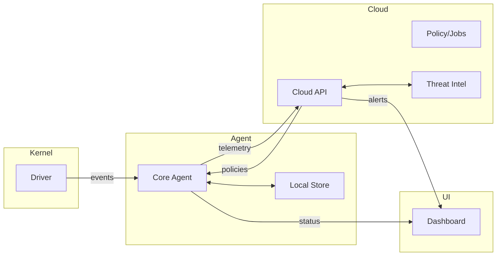

# Aegis Fusion - Arquitectura de Producto (EDR/AV)

Documento tecnico de referencia para evolucionar Aegis Fusion como producto
EDR/AV moderno con driver + agente + cloud + UI. Esta guia prioriza contratos
claros, seguridad end-to-end, operacion confiable y explicabilidad.

## 0) Diagrama de alto nivel

## 1) Contratos por capa (event contract versionado)

### Principio

El driver no debe "adivinar" logica de negocio. Produce telemetria confiable y
acciones puntuales. El agente y la nube aplican correlacion, reglas, ML y
politicas.

### Contrato de evento

Contrato versionado y estable entre driver -> agente -> cloud. Recomendado:
protobuf (u otra serializacion estricta) con version de schema. Los tipos
compartidos deben vivir en `common/` y versionarse junto al codigo.

Campos minimos:
- event_id: u64
- event_version: u32
- event_type: enum (process/file/network/registry/memory)
- timestamp: unix_ms
- pid/ppid
- process_name
- process_path
- command_line
- user
- integrity_level
- hashes (sha256)
- device_id

Reglas:
- Compatibilidad hacia atras (compat mode) al agregar campos.
- Campos nuevos siempre opcionales.
- Reglas de tamanio y truncamiento definidas.
- Validacion estricta en el agente.

### Driver (Kernel)

Responsabilidad:
- Telemetria minimal: create process, file write, image load, network connect,
  registry modify, memory protect.
- Enforcement puntual: block file, deny process, network block (si esta
  disponible a nivel kernel).

No hacer:
- ML pesado.
- Reglas de negocio.
- Enriquecimiento externo.

### Agente (Core / Rust)

Responsabilidad:
- Correlacion y enriquecimiento local.
- Motor de reglas/IOC.
- Escaneo bajo demanda.
- Uploader y buffer offline.
- Self-protection (basic).
- Degradacion elegante si el driver no esta disponible.

### Cloud (Go API)

Responsabilidad:
- Multi-tenant.
- Politicas centralizadas (rulesets por grupo).
- Inventario de endpoints.
- Alertas, jobs y rollouts.
- Modo offline tolerante.

### UI (React)

Responsabilidad:
- Panel de endpoints.
- Politicas y excepciones.
- Detecciones y timeline.
- Estado de servicio.

## 2) Seguridad end-to-end (mTLS + identidad del endpoint)

Objetivo: evitar un dashboard sin controles fuertes de identidad.

- mTLS agente <-> cloud con certificado por endpoint.
- Pinning de CA y rotacion.
- Revocacion inmediata por endpoint comprometido.
- Identidad de device con claves protegidas (TPM si existe).
- Token de sesion con TTL corto.

## 3) Flujos clave

### Telemetria y decision local

1) Driver emite eventos de proceso/archivo/red.
2) Agente enriquece (hash, path, user).
3) Motor de reglas y ML determina el riesgo.
4) Se aplica accion local (monitor/quarantine/block).
5) Se sube evidencia a cloud si aplica.

### Subida de muestra

1) Agente envia archivo a `/api/v1/upload`.
2) Cloud encola analisis.
3) Sandbox o analisis interno produce resultado.
4) Cloud actualiza reputacion.
5) Agente recibe verdict y actualiza cache local.

### Politicas

1) Cloud genera policy por grupo.
2) Agente descarga y valida firma.
3) Se aplican cambios y se guarda estado.

## 4) Modelo de amenazas (resumen)

- Spoofing: identidad de endpoint -> mTLS + device keys.
- Tampering: eventos y policies -> firma, hash, validacion estricta.
- Repudiation: acciones -> audit log inmutable.
- Information disclosure: datos sensibles -> cifrado en transito y reposo.
- Denial of service: rate limit, backoff, colas y limites de tamano.
- Elevation of privilege: driver minimo, surface reducida, hardening.

## 5) Update pipeline serio

Requisitos minimos:
- Canales: stable / beta / canary.
- Firmado de binarios (driver obligatorio).
- Rollback automatico ante fallas.
- Staged rollout por grupos.

Datos por version:
- hash, firma, notas, riesgos conocidos.
- compatibilidad con esquema de eventos.

## 6) Windows driver: supervivencia y firma

Problema: sin firma, no hay escala.

Checklist:
- Build aislado (CI separado).
- Tests basicos: load/unload, stress, callbacks.
- Validaciones de IRQL y manejo de errores.
- Feature flags para activar/desactivar rutas sensibles.
- Modo userland si driver no esta listo.

## 7) ML: que sume, no que rompa

Reglas:
- Feature extraction determinista.
- Modelo intercambiable.
- Score + top features en la deteccion.
- Modo rules-first por defecto.

Se recomienda:
- Threshold ajustable en policy.
- Registro de la razon (features, score, rule id).

## 8) Manejo de muestras y tests

No subir muestras reales sin control.
Si se requieren:
- cifrar (zip con password) y documentar.
- CI nunca debe ejecutarlas.
- preferir hashes/IOCs y simuladores benignos.

## 9) Observabilidad y confiabilidad

- Logs con niveles y rotacion.
- Telemetria de performance: CPU, RAM, latencias.
- Alertas de salud (agent down, driver down, cloud unreachable).
- Modo offline (buffer y reintento).

## 10) Roadmap tecnico sugerido

1) Contrato versionado de eventos.
2) mTLS y device identity.
3) Pipeline de updates con canales.
4) Driver tests + firma.
5) ML explicable + rules-first.
6) Inventario, policy y jobs en cloud.

---

Este documento se mantiene vivo. Toda evolucion debe respetar el contrato y
evitar romper compatibilidad en endpoints desplegados.
