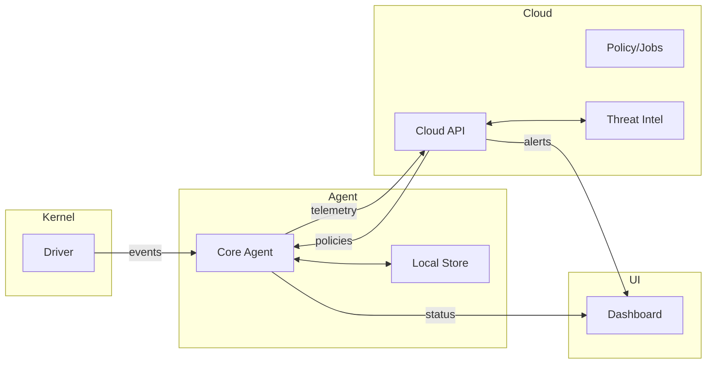

# Aegis Fusion — Product Architecture (EDR/AV)

Technical reference document for evolving Aegis Fusion as a modern EDR/AV product
with driver + agent + cloud + UI. Priorities: clear contracts, end-to-end security,
reliable operation, and explainability.

## High-level diagram

```mermaid
flowchart LR
  subgraph Kernel
    D[Driver]
  end
  subgraph Agent
    A[Core Agent]
    S[Local Store]
  end
  subgraph Cloud
    C[Cloud API]
    P[Policy/Jobs]
    I[Threat Intel]
  end
  subgraph UI
    U[Dashboard]
  end
  D -->|events| A
  A -->|telemetry| C
  C -->|policies| A
  A -->|status| U
  C -->|alerts| U
  A <--> S
  C <--> I
```

## Layer contracts (versioned event contract)

### Principle

The driver must not embed business logic. It produces reliable telemetry and
targeted actions. The agent and cloud apply correlation, rules, ML, and policies.

### Event contract

Versioned, stable contract between driver → agent → cloud.
Recommended: protobuf with schema version. Shared types live in `common/`.

Minimum fields:
- `event_id: u64`
- `event_version: u32`
- `event_type: enum (process/file/network/registry/memory)`
- `timestamp: unix_ms`
- `pid / ppid`
- `process_name`, `process_path`, `command_line`
- `user`, `integrity_level`
- `hashes (sha256)`
- `device_id`

Rules:
- Backward compatibility when adding fields (compat mode).
- New fields always optional.
- Defined size limits and truncation rules.
- Strict validation at the agent level.

## Security — mTLS + endpoint identity

Goal: no dashboard without strong identity controls.

- mTLS agent ↔ cloud with per-endpoint certificate.
- CA pinning and rotation.
- Immediate revocation per compromised endpoint.
- Device identity with TPM-backed keys where available.
- Short-TTL session tokens.

## Key flows

### Telemetry and local decision

1. Driver emits process/file/network events.
2. Agent enriches (hash, path, user).
3. Rules engine + ML determines risk score.
4. Local action applied (monitor / quarantine / block).
5. Evidence uploaded to cloud if applicable.

### Sample upload

1. Agent sends file to `/api/v1/upload`.
2. Cloud queues analysis.
3. Sandbox or internal analysis produces verdict.
4. Cloud updates reputation.
5. Agent receives verdict and updates local cache.

### Policy distribution

1. Cloud generates policy per group.
2. Agent downloads and validates signature.
3. Changes applied and state persisted.

## Threat model (summary)

| STRIDE | Mitigation |
|---|---|
| Spoofing | mTLS + device keys |
| Tampering | Signed events and policies, strict validation |
| Repudiation | Immutable audit log |
| Info disclosure | Encryption in transit and at rest |
| DoS | Rate limiting, backoff, queue size limits |
| Elevation of privilege | Minimal driver surface, hardening |

## ML approach

- Deterministic feature extraction.
- Swappable model interface.
- Score + top features in every detection.
- Rules-first by default; ML as scoring layer.
- Adjustable threshold per policy.
- Detection reason logged (features, score, rule ID).

## Technical roadmap

1. Versioned event contract
2. mTLS and device identity
3. Update pipeline with stable/beta/canary channels
4. Driver tests + code signing
5. Explainable ML + rules-first enforcement
6. Inventory, policy, and jobs in cloud

---

*This document is kept live. All evolution must respect the contract and avoid
breaking compatibility on deployed endpoints.*